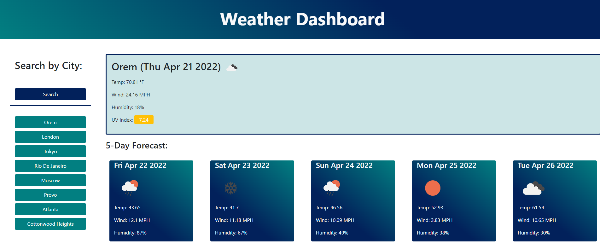

# Weather Dashboard

## Description
This repository contains a webpage for a weather dashboard. A city can be searched for through the text input. Current weather will be displayed, including the temperature, wind speed, humidity, and UV index. A five day forecast will also display with similar information. All information is obtained from OpenWeather.

Technologies used include HTML, CSS, Javascript, Bootstrap, and server-side API's.

## Features
* Cities searched for through the text input will be saved as new buttons representing the search history
* The search history buttons save the last 10 cities with the most recent at the top
* The city name and current date display above a description of the current weather
* The UV index is color coded depending on severity (green for favorable, yellow for moderate, and red for severe)
* A five day forecast shows the temperature, wind speed, and humidity for the next five days
* Icons are also used to visually demonstrate weather conditions

## Links

[Deployed website](https://wgrout87.github.io/Weather-Dashboard/)

[Code repository](https://github.com/wgrout87/Weather-Dashboard)

## Usage
This repository contains a weather dashboard webpage, which can be viewed on a variety of devices as it has been configured for multiple screen dimensions.

The deployed website should resemeble the following screenshot.

## Credits
This project was made possible by the OpenWeather API - https://openweathermap.org/api. The weather and onecall APIs were used.